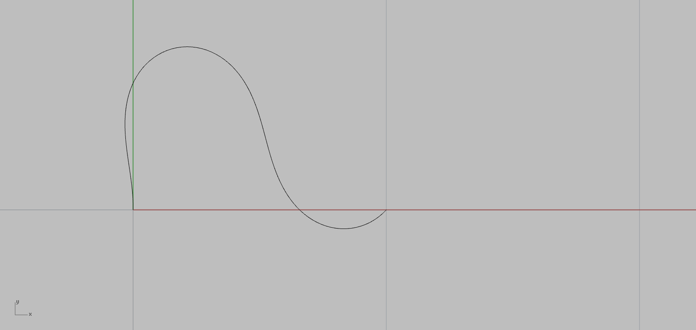

# A library for designing with elastic curves (Euler's Elastica)

This GITHUB repo contrains algorithms for designing with an elastic curve, elastic splines, and surfaces foliated by elastic splines (https://en.wikipedia.org/wiki/Elastica_theory).

Because elastic curves describe the shape of a flexible blade, the algorithms can be employed by architects/designers to create form work made with robotic hot-blade cutting (https://odico.dk/en/technologies#robotic-hot-blade-cutting) or wooden strip designs.  

## Getting started

In the folder "For Rhino" we include "demoElasticaTools.py" that contains demonstration of the features from the dll files.
In the folder "MATLAB prototypes" we include features/prototypes developed and tested in MATLAB.

### Prerequisites

The code in the folder "For Rhino" was developed for Rhinoceros 5 64 bit. The MATLAB code was developed using MATLAB R2016b.

### Installing

To test the features for Rhino: download the folder "For Rhino", open Rhinoceros and the Python editor (command: "EditPythonScript"). Once the Python editor is open, open the file "demoElasticaTools.py" and run the script (click on the green arrow).

To test the MATLAB prototypes download the MATLAB files in the folder for the prototypes and run the prototype directly from MATLAB.

## Features and demostrations

### Rhinoceros

In the folder "For Rhino" we include the demoElasticaTools.py that contains demonstration of the features from the dll files.
At the top of the file we write:

```
import Rhino
import math
import rhinoscriptsyntax as rs
from Rhino.Geometry import *
import Rhino.Geometry.Point3d as Point3D
import scriptcontext
import sys
from System import Array
from System import Double
import clr
clr.AddReferenceToFileAndPath("DyLibs/ElasticaForRhino")
from ElasticaForRhino import Elastica
import cPickle as pickle
```

In the demonstration we test:

- a discrete Elastica boundary value solver. Given endpoints, end tangents, and curve length we compute a dicrete elastica satisfying these conditions.

```
def add_curve_to_rhino(P, N):
    pts_out = []
    for i in range(0,N*2,2):
        pt = Point3d(P[i],P[i+1],0)
        pts_out.append(pt)
    pl  = Rhino.Geometry.Polyline(pts_out)
    plc = Rhino.Geometry.PolylineCurve(pl)
    scriptcontext.doc.Objects.AddCurve(plc)

e = Elastica()
P_discrete_elastica = Array.CreateInstance(Double,(101)*2)
iter = e.discrete_elastica(0,0, 1,0, 0,1,1,1, 2, 100, P_discrete_elastica)
add_curve_to_rhino(P_discrete_elastica, 100+1)
```



- Estimation of an analytical elastic curve given a set of points.

```
e = Elastica()
curve = rs.GetObject("Choose planar curve (z=0) to estimate elastica",4,True)
domain = rs.CurveDomain(curve)
P_samples = Array.CreateInstance(Double,(101)*2)
for i in range(0,101*2,2):
    t = domain[0]*(1-(i/202))+(i/202)*domain[1]
    P = rs.EvaluateCurve(curve,t)
    P_samples[i] = P[0]
    P_samples[i+1] = P[1]

options = Array.CreateInstance(Double,1)
analytic_elastica_params = Array.CreateInstance(Double,9)
options = Array.CreateInstance(Double,1)
e.compute_elastica_parameters(P_samples, 101, options, analytic_elastica_params)
```

- Evaluation of elastica given the seven parameters analytic_elastica_params.

```
samples = Array.CreateInstance(Double, 2*100)
e.sample_elastica(analytic_elastica_params, -0.15, 1.15, 100, samples)
add_curve_to_rhino(samples, 100)
```


### MATLAB

## Authors

David Brander, J. Andreas Bærentzen, Ann-Sofie Fisker, Jens Gravesen.
Technical University of Denmark.

### References

Approximation by planar elastic curves
David Brander, Jens Gravesen, Toke Bjerge Nørbjerg.
Advances in Computational Mathematics, 2017.

Bézier curves that are close to elastica
David Brander, J. Andreas Bærentzen, Ann-Sofie Fisker, Jens Gravesen.
Computer-Aided Design, 2018.

Designing interactively with elastic splines
David Brander, J. Andreas Bærentzen, Ann-Sofie Fisker, Jens Gravesen.
Computer-Aided Geometric Design, 2018. 

## License
This project is licensed under the MIT License.


